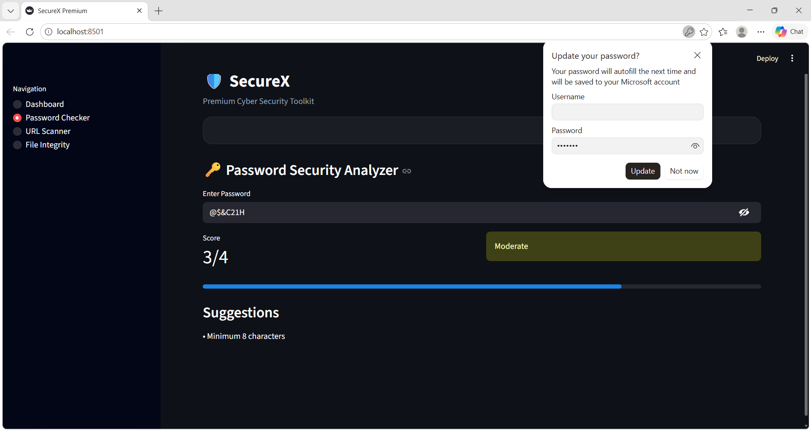
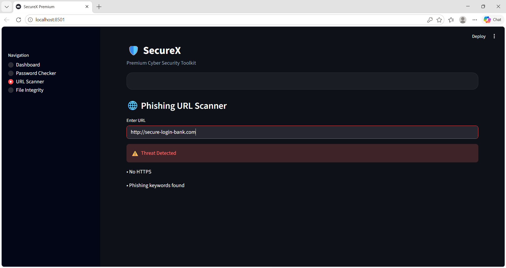
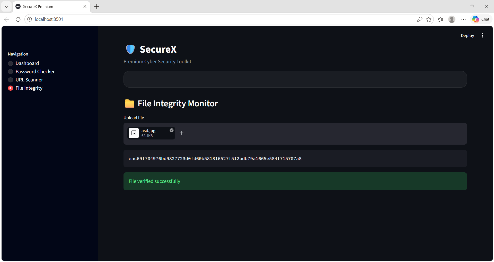
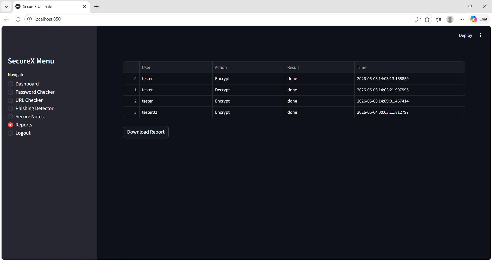

# 🔐 SecureX – Cyber Security Toolkit

## 🌐 Live Demo

👉 https://securex-toolkit-hqiysmsxmb2gz7behuqqkx.streamlit.app/

---

## 🚀 Project Overview

SecureX is a web-based **Cyber Security Toolkit** developed using Python and Streamlit.
It helps users identify and analyze common security threats such as weak passwords, phishing messages, and unsafe URLs.
The application also provides encryption and decryption features along with activity logging and report generation.

---

## 🎯 Key Features

### 🔑 Authentication System

* Secure login and signup functionality
* Passwords stored using hashing
* Session-based user management

---

### 🛡️ Password Strength Checker

* Evaluates password strength (0–5 score)
* Checks:

  * Uppercase letters
  * Lowercase letters
  * Numbers
  * Special characters
  * Minimum length

---

### 🌐 URL Safety Checker

* Detects suspicious or unsafe URLs
* Flags:

  * Non-HTTPS links
  * IP-based URLs
  * Long or abnormal URLs
  * Phishing patterns

---

### 🎣 Phishing Detection

* Analyzes messages/emails for phishing attempts
* Detects:

  * Urgent or threatening language
  * Fake alerts (bank/security)
  * Suspicious keywords
  * Scam patterns

---

### 🔐 Encrypt & Decrypt

* Secure note encryption using Fernet cryptography
* Allows users to safely encrypt and decrypt sensitive data

---

### 💾 Database Logging

* Uses SQLite database
* Stores:

  * User actions
  * Results
  * Timestamps

---

### 📊 Report Generation

* Displays activity logs in dashboard
* Allows users to download reports in CSV format

---

## 🖥️ Tech Stack

* Python 🐍
* Streamlit 🌐
* SQLite 💾
* Cryptography (Fernet) 🔐
* Pandas 📊
* Regex 🧾

---

## 📸 Screenshots

### 🔑 Password Checker



### 🌐 URL Checker



### 🎣 Phishing Detector



### 🔐 Encrypttion & Decryption


### 📊 Report System



---

## 🧠 Project Architecture

User → Streamlit UI → Security Modules → Database → Report System

---

## 📦 Installation & Setup

```bash
git clone https://github.com/chithrasagadevan2008-lgtm/securex-toolkit.git
cd securex-toolkit
pip install -r requirements.txt
python -m streamlit run app.py
```

---

## 📄 requirements.txt

```
streamlit
cryptography
pandas
```

---

## 🔮 Future Enhancements

* AI-based phishing detection
* Real-time risk scoring system
* User-specific dashboards
* Cloud database integration
* UI/UX improvements

---

## 👨‍💻 Author

Developed as a Cyber Security Mini Project

---

## ⚠️ Disclaimer

This project is intended for educational purposes only and does not provide production-level security.

